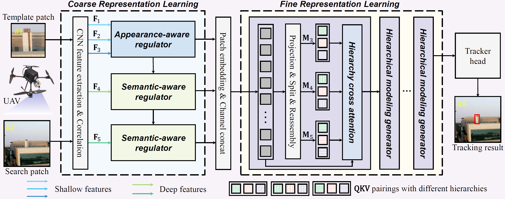

# PRL-Track: Progressive Representation Learning for Real-Time UAV Tracking
Changhong Fu∗, Xiang Lei, Haobo Zuo, Liangliang Yao, Guangze Zheng, and Jia Pan
* Corresponding author.

This is the official code for the paper "Progressive Representation Learning for Real-Time UAV Tracking".

## Framework
Visual object tracking has significantly promoted autonomous applications for unmanned aerial vehicles (UAVs). However, learning robust object representations for UAV tracking is especially challenging in complex dynamic environments, when confronted with aspect ratio change and occlusion. These challenges severely alter the original information of the object. To handle the above issues, this work proposes a novel progressive representation learning framework for UAV tracking, i.e., PRL-Track. Specifically, PRL-Track is divided into coarse representation learning and fine representation learning. For coarse representation learning, an innovative appearance-aware regulator and a convenient semantic-aware regulator are designed to mitigate appearance interference and capture semantic information. Furthermore, for fine representation learning, a new hierarchical modeling generator is developed to intertwine coarse object representations. Exhaustive experiments demonstrate that the proposed PRL-Track delivers exceptional performance on three authoritative UAV tracking benchmarks. Real-world tests indicate that the proposed PRL-Track realizes superior tracking performance with 42.6 frames per second on the typical UAV platform equipped with an edge smart camera.



## Video Demo 
TODO

## Setup

### Requirements
This code has been tested on Ubuntu 18.04, Python 3.8.3, Pytorch 1.13.1, and CUDA 11.6. 

Please install related libraries before running this code:

```bash
pip install -r requirements.txt
```

## Getting started

### Training

#### Prepare training datasets
Download the datasets：
* [COCO](http://cocodataset.org)
* [GOT-10K](http://got-10k.aitestunion.com/downloads)
* [LaSOT](http://vision.cs.stonybrook.edu/~lasot)

Note: Crop data following the instruction for [COCO](https://github.com/vision4robotics/HiFT/blob/main/training_dataset/coco/readme.md), [GOT-10k](https://github.com/vision4robotics/HiFT/blob/main/training_dataset/got10k/readme.md) and [LaSOT].

Then modify the corresponding path in `pysot/core/config.py`.

```bash
python tools/train.py
```

### Testing
Download pretrained model: [PRL-Track](xxx) and put it into `tools/snapshot` directory.

Download testing datasets and put them into `test_dataset` directory. If you want to test the tracker on a new dataset, please refer to [pysot-toolkit](https://github.com/StrangerZhang/pysot-toolkit) to set test_dataset.

```bash
python tools/test.py 
```
   
The testing result will be saved in the `results/dataset_name/tracker_name` directory.

### Evaluation
We provide the tracking [results](xxx) of UAVTrack112, UAVTrack112_L, and UAV123. If you want to evaluate the tracker, please put those results into results directory.

```bash
python tools/eval.py
```

## Qualitative Evaluation


## Acknowledgments
The code is implemented based on [pysot](https://github.com/STVIR/pysot) and [HiFT](https://github.com/vision4robotics/HiFT). We would like to express our sincere thanks to the contributors.

## Contact
If you have any questions, please contact Xiang Lei at [2053932@tongji.edu.cn](2053932@tongji.edu.cn).
